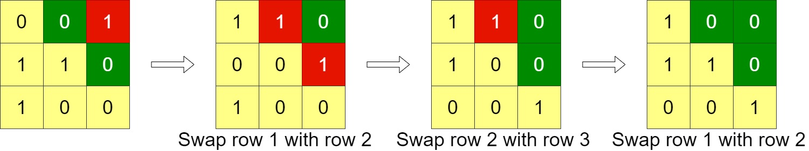
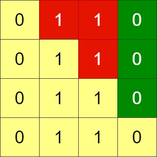
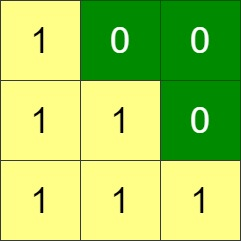

# 1536. Minimum Swaps to Arrange a Binary Grid

## Problem Description

Given an `n x n` binary grid, in one step you can choose two adjacent rows of the grid and swap them. A grid is said to be valid if all the cells above the main diagonal are zeros. The main diagonal of a grid is the diagonal that starts at cell `(0, 0)` and ends at cell `(n-1, n-1)` (using 0-indexed coordinates).

Return the minimum number of steps needed to make the grid valid, or return `-1` if the grid cannot be made valid.

**Example 1:**

 
* Input: grid = `[[0,0,1],[1,1,0],[1,0,0]]`
* Output: `3`

**Example 2:**

* Input: grid = `[[0,1,1,0],[0,1,1,0],[0,1,1,0],[0,1,1,0]]`
* Output: `-1`

    Explanation: All rows are similar, swaps have no effect on the grid.
    
**Example 3:**

* Input: `grid = [[1,0,0],[1,1,0],[1,1,1]]`
* Output: `0`

**Constraints:**

* `n == grid.length == grid[i].length`
* `1 <= n <= 200`
* `grid[i][j]` is either `0` or `1`

## Approach

The problem asks us to arrange the grid such that all elements above the main diagonal are `0`. If we look at this row by row (from top to bottom), this requirement translates to a specific number of trailing zeros needed for each row.

1. **Reduce to 1D Array**: For a grid of size `n`, the row at index `i` requires at least `n - 1 - i` continuous zeros at the end of the row. We can iterate through each row and count its trailing zeros, storing these counts in a 1D array (let's call it `zeros`).
2. **Greedy Search**: We iterate through our target rows from `i = 0` to `n - 1`. For each target row `i`, we need a value in our `zeros` array that is greater than or equal to `n - 1 - i`. We search downwards starting from `j = i` to find the first row that meets this requirement.
3. **Bubble Up (Simulate Swaps)**: Once we find the first valid row at index `j`, we simulate the adjacent swaps by shifting it up to position `i`. This takes exactly `j - i` steps. We increment our step counter and shift all elements between `i` and `j - 1` down by one position in our `zeros` array to reflect the physical rows being pushed down.
4. **Failure Condition**: If at any point we search from `j = i` to `n - 1` and cannot find a row with enough trailing zeros, it is impossible to make the grid valid. We return `-1`.

## Key Breakthroughs

* **Dimensionality Reduction**: The most crucial realization is that the exact arrangement of `1`s and `0`s at the beginning of the rows does not matter. The only metric that determines if a row can be placed at index `i` is the length of its continuous trailing zeros. This transforms a 2D matrix problem into a 1D array manipulation problem.
* **Greedy Choice**: Because we are only allowed to swap adjacent rows, pulling a row up from below costs a number of steps equal to its distance. To minimize steps, we should always pick the closest valid row below our current target.
* **Virtual Swapping**: Instead of swapping the actual `std::vector<int>` rows in the `grid` (which is computationally expensive), we only swap the integer values inside our 1D `zeros` array.

## Complexity Analysis

* **Time Complexity**: $O(N^2)$
    * Calculating the trailing zeros for all rows takes $O(N^2)$ time since we might inspect every cell in the worst case.
    * The greedy swapping process uses an outer loop running $N$ times, and an inner loop searching and shifting elements which takes at most $O(N)$ time. Thus, the swapping phase is also $O(N^2)$.
    * Overall time complexity remains $O(N^2)$, which is highly efficient and easily passes the `n <= 200` constraint.

* **Space Complexity**: $O(N)$
    * Use a single 1D array of size N to store the trailing zeros count for each row.