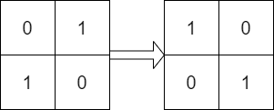
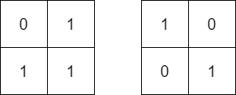
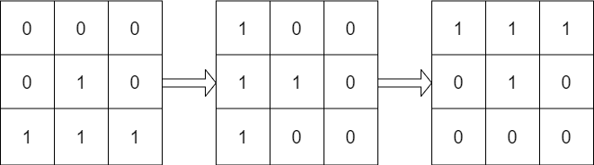

# 1886. Determine Whether Matrix Can Be Obtained By Rotation

## Problem Description
Given two `n x n` binary matrices `mat` and `target`, return `true` if it is possible to make `mat` equal to `target` by **rotating** `mat` in **90-degree increments**, or `false` otherwise.

**Example 1:**

* **Input:** `mat = [[0,1],[1,0]], target = [[1,0],[0,1]]`
* **Output:** `true`
* **Explanation:** We can rotate mat 90 degrees clockwise to make mat equal target.

**Example 2:**

* **Input:** `mat = [[0,1],[1,1]], target = [[1,0],[0,1]]`
* **Output:** `false`
* **Explanation:** It is impossible to make mat equal to target by rotating mat.

**Example 3:**

* **Input:** `mat = [[0,0,0],[0,1,0],[1,1,1]], target = [[1,1,1],[0,1,0],[0,0,0]]`
* **Output:** `true`
* **Explanation:** We can rotate mat 90 degrees clockwise two times to make mat equal target.

**Constraints:**
* `n == mat.length == target.length`
* `n == mat[i].length == target[i].length`
* `1 <= n <= 10`
* `mat[i][j]` and `target[i][j]` are either `0` or `1`.

---

## Approach

This problem can be elegantly solved by simulating the matrix rotation. Since rotating a matrix by 360 degrees brings it back to its original state, there are only **4 possible states** to check (0°, 90°, 180°, and 270°).

The core of the solution is the standard algorithm to **rotate an $N \times N$ matrix 90 degrees clockwise in-place**. This can be broken down into two simple steps:
1. **Transpose:** Swap elements across the main diagonal (i.e., swap `mat[i][j]` with `mat[j][i]`).
2. **Reverse:** Reverse each individual row of the matrix.

**Workflow:**
1. Loop 4 times (for the 4 possible rotation states).
2. At the beginning of each iteration, check if `mat == target`. If yes, return `true` immediately (this also handles the 0-degree rotation case).
3. If they don't match, apply the "Transpose + Reverse" trick to rotate `mat` by 90 degrees clockwise.
4. If the loop finishes all 4 iterations without finding a match, return `false`.

---

## Complexity Analysis

* **Time Complexity:** $O(N^2)$
  Comparing two matrices takes $O(N^2)$ time. Rotating the matrix also takes $O(N^2)$ time. Since we only do this a maximum of 4 times, the total time complexity is $O(4 \times N^2)$, which simplifies to $O(N^2)$. Given the constraint $N \le 10$, this will execute extremely fast.
* **Space Complexity:** $O(1)$ Auxiliary Space
  We are modifying `mat` in-place using `swap` and `reverse`. We do not allocate any additional matrices, keeping the space complexity strictly constant.
