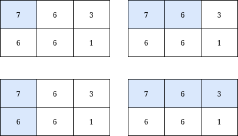

# 3070. Count Submatrices with Top-Left Element and Sum Less Than k

## Problem Description
You are given a **0-indexed** integer matrix `grid` and an integer `k`.
Return the **number** of submatrices that contain the top-left element of the `grid`, and have a sum less than or equal to `k`.

**Example 1:**

* **Input:** `grid = [[7,6,3],[6,6,1]], k = 18`
* **Output:** `4`
* **Explanation:** There are only 4 submatrices that contain the top-left element of grid, and have a sum less than or equal to 18.

**Example 2:**

* **Input:** `grid = [[7,2,9],[1,5,0],[2,6,6]], k = 20`
* **Output:** `6`
* **Explanation:** There are only 6 submatrices, shown in the image above, that contain the top-left element of grid, and have a sum less than or equal to 20.

**Constraints:**
* $m == grid.length$
* $n == grid[i].length$
* $1 \le n, m \le 1000$
* $0 \le grid[i][j] \le 1000$
* $1 \le k \le 10^9$

---

## Approach

This problem is a textbook application of the **2D Prefix Sum** (also known as the Inclusion-Exclusion Principle). 

Instead of recalculating the sum of the submatrix for every single cell from scratch (which would result in a Time Limit Exceeded error), we build the sum progressively based on the results of previously calculated neighboring cells.

### Step 1: The Inclusion-Exclusion Principle
To find the total sum of the submatrix from the top-left corner `(0, 0)` down to the current cell `(i, j)`, we can use the sums of the submatrices we have already computed:
1.  **Take the sum from the top:** The sum of the submatrix ending at `(i-1, j)`.
2.  **Take the sum from the left:** The sum of the submatrix ending at `(i, j-1)`.
3.  **Subtract the overlap:** The top-left region ending at `(i-1, j-1)` was added twice (once in the top sum, once in the left sum), so we must subtract it once.
4.  **Add the current cell:** Finally, add the original value of `grid[i][j]`.

The mathematical formula translates to:
$$Sum(i, j) = grid[i][j] + Sum(i-1, j) + Sum(i, j-1) - Sum(i-1, j-1)$$

### Step 2: Early Pruning (Optimization)
Look closely at the constraints: `0 <= grid[i][j] <= 1000`. 
Because there are **no negative numbers** in the matrix, the prefix sum is monotonically increasing. This means as we move further to the right (increasing `j`), the sum will only get larger or stay the same. 
If at some point $Sum(i, j) > k$, we can immediately `break` out of the inner loop because all subsequent cells in that row will also exceed `k`.

---

## Complexity Analysis

* **Time Complexity:** $O(m \times n)$
    We iterate through each cell of the matrix exactly once. The mathematical operations inside the loop are all $O(1)$. The early `break` optimization makes it even faster in practice.
* **Space Complexity:** $O(1)$
    We are modifying the input `grid` directly to store the prefix sums. No extra 2D arrays are created, so the auxiliary space is strictly constant.
