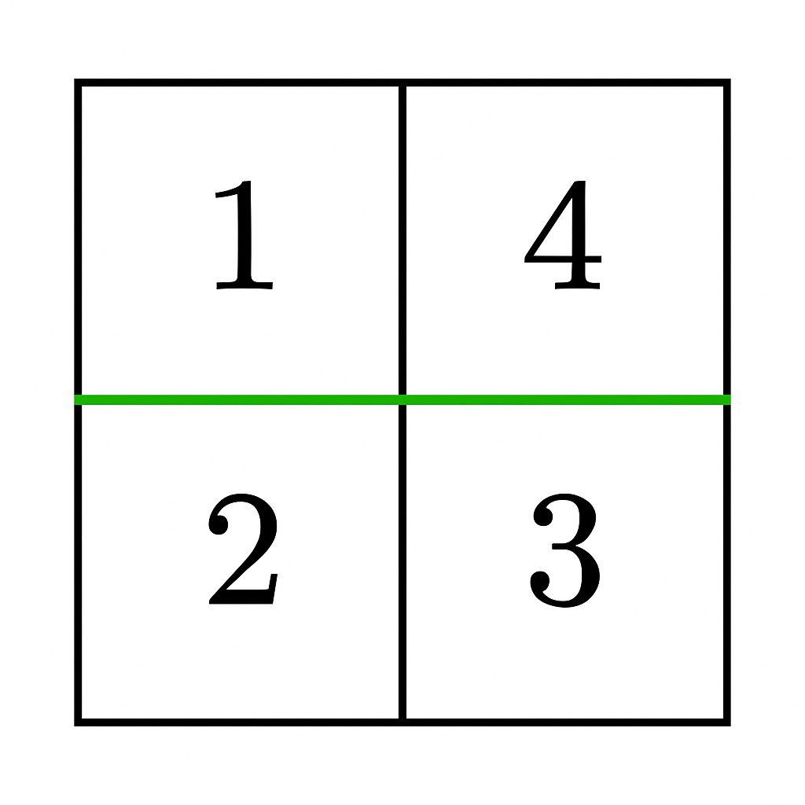

# Partition Grid into Two Equal Sum Sections

## Problem Description
You are given an `m x n` matrix `grid` of **positive integers**. Your task is to determine if it is possible to make **either one horizontal or one vertical cut** on the grid such that:
1. Each of the two resulting sections formed by the cut is **non-empty**.
2. The sum of the elements in both sections is **equal**.

Return `true` if such a partition exists; otherwise return `false`.

**Example 1:**

* **Input:** `grid = [[1,4],[2,3]]`
* **Output:** `true`
* **Explanation:** A horizontal cut between row 0 and row 1 results in two non-empty sections, each with a sum of 5.

**Example 2:**
* **Input:** `grid = [[1,3],[2,4]]`
* **Output:** `false`
* **Explanation:** No horizontal or vertical cut results in two non-empty sections with equal sums.

**Constraints:**
* $1 \le m == grid.length \le 10^5$
* $1 \le n == grid[i].length \le 10^5$
* $2 \le m \times n \le 10^5$
* $1 \le grid[i][j] \le 10^5$

---

## Approach

This problem is a 2D variation of the classic "Partition Equal Subset Sum" problem, but with a strict geometric constraint: we can only split the grid by making a **straight line cut** (entire rows or entire columns).

### Step 1: Base Case Check (Parity)
First, we calculate the `total` sum of all elements in the grid. Since we need to split the grid into two sections with equal sums, the total sum **must be an even number**. If `total % 2 != 0`, we can immediately return `false`. If it is even, our target sum for one section is `total / 2`.

### Step 2: Simulate Horizontal Cuts (Row by Row)
A horizontal cut means we group rows `0` to `i` as the top section, and the remaining rows as the bottom section. 
We iterate through the rows, keeping a running sum. 
* **Crucial Boundary:** We loop from `i = 0` up to `i < m - 1`. We must **stop before the last row** to ensure the bottom section is "non-empty" (as required by the problem).
* If our running sum hits the `target`, a valid horizontal cut exists!

### Step 3: Simulate Vertical Cuts (Column by Column)
If no horizontal cut works, we reset our running sum and try vertical cuts.
A vertical cut means we group columns `0` to `j` as the left section, and the rest as the right section.
* **Crucial Boundary:** We loop from `j = 0` up to `j < n - 1`. Again, we must **stop before the last column** to ensure the right section is "non-empty".
* If our running sum hits the `target`, a valid vertical cut exists!

---

## Complexity Analysis

* **Time Complexity:** $O(m \times n)$
  We iterate through all elements to find the total sum, which takes $O(m \times n)$. Then, checking horizontal cuts visits each element at most once $O(m \times n)$, and checking vertical cuts visits each element at most once $O(m \times n)$. The overall time complexity is strictly linear with respect to the total number of cells in the grid.
* **Space Complexity:** $O(1)$
  We only use a few variables (`total`, `target`, `sum`) to keep track of the values. We do not allocate any additional arrays or data structures, making the space complexity constant.
