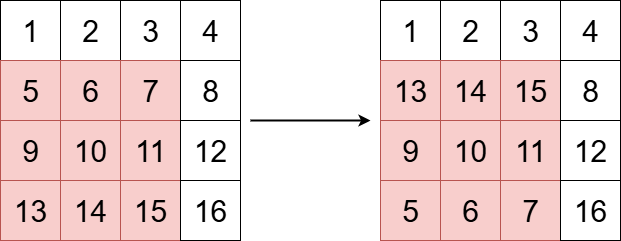

# 3643. Flip Square Submatrix Vertically

## Problem Description
You are given an `m x n` integer matrix `grid`, and three integers `x`, `y`, and `k`.
The integers `x` and `y` represent the row and column indices of the **top-left** corner of a **square** submatrix and the integer `k` represents the size (side length) of the square submatrix.

Your task is to flip the submatrix by reversing the order of its rows vertically.
Return the updated matrix.

**Example:**

* **Input:** `grid = [[1,2,3,4],[5,6,7,8],[9,10,11,12],[13,14,15,16]], x = 1, y = 0, k = 3`
* **Output:** `[[1,2,3,4],[13,14,15,8],[9,10,11,12],[5,6,7,16]]`

**Constraints:**
* `m == grid.length`
* `n == grid[i].length`
* `1 <= m, n <= 50`
* `1 <= grid[i][j] <= 100`
* `0 <= x < m`
* `0 <= y < n`
* `1 <= k <= min(m - x, n - y)`

---

## Approach

This is a straightforward **Matrix Manipulation** problem. We need to vertically flip a specific `k x k` square submatrix inside a larger grid. 

To achieve this without using extra space, we can use a **Double For-Loop (Math-based)** approach to swap elements in-place:
1. **Vertical Iteration (Outer Loop):** We only need to swap the top half of the submatrix with its bottom half. Therefore, the outer loop should only run `k / 2` times. If we run it `k` times, we will flip the matrix and then accidentally flip it back to its original state!
2. **Horizontal Iteration (Inner Loop):** We iterate through all `k` columns of the submatrix.
3. **Coordinate Mapping:**
   * The top element is located at row `x + i` and column `y + j`.
   * The corresponding symmetrical bottom element is located at row `x + k - 1 - i` and column `y + j`.
   * We simply swap these two elements.

---

## Complexity Analysis

* **Time Complexity:** `O(k^2)`
  We are iterating through half of the rows (`k/2`) and all of the columns (`k`) within the submatrix. The number of swap operations is exactly `(k^2) / 2`. Since `k` is at most 50, the maximum number of operations is around 1250, which takes less than a millisecond.
* **Space Complexity:** `O(1)`
  We modify the `grid` completely in-place. No extra matrices or arrays are allocated, making the space complexity strictly constant.
